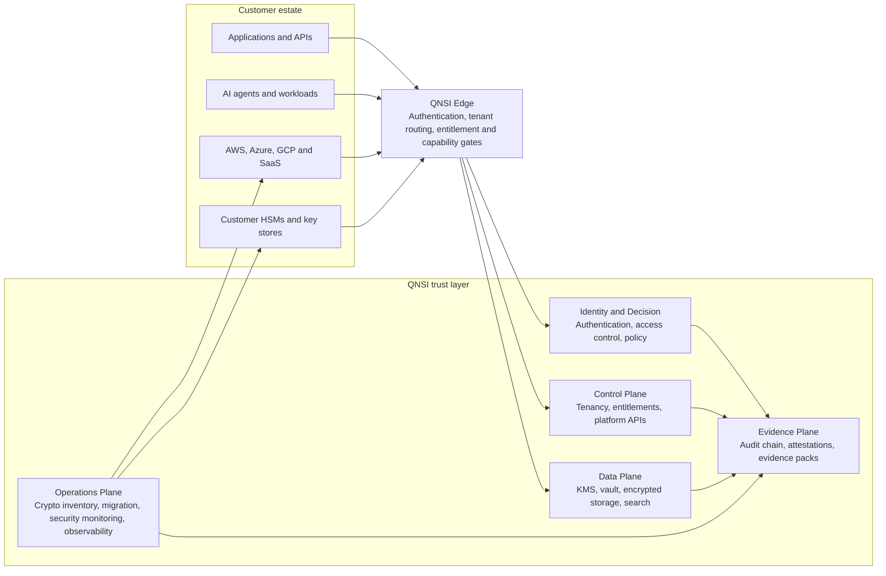

# QNSI

**Post-quantum security infrastructure for keys, secrets, storage, cryptographic discovery, governed migration, audit evidence, and AI workloads.**

[](https://www.npmjs.com/package/@heossihq/qnsi)
[](https://pypi.org/project/qnsi/)
[](https://crates.io/crates/qnsi)
[](https://central.sonatype.com/artifact/com.heossi/qnsi)
[](LICENSE.md)

[Website](https://qnsi.heossi.com) | [Documentation](https://docs.qnsi.heossi.com) | [Live PQC verification](https://qnsi.heossi.com/verify) | [Benchmarks](https://qnsi.heossi.com/benchmarks) | [System status](https://qnsi.heossi.com/status) | [Start free](https://cloud.qnsi.heossi.com/auth?mode=signup)

QNSI is running security infrastructure, not a cryptography wrapper or a single-purpose developer tool. It provides a dedicated trust layer that applications, AI workloads, cloud estates, and customer-controlled hardware consume through authenticated APIs, SDKs, the CLI, and MCP.

The platform spans 18 production services across identity, access decisions, tenancy, key management, secrets, encrypted storage, search, cryptographic discovery, governed migration, audit evidence, security operations, and observability. This repository is the public, inspectable integration and evidence surface exported from that platform.

## The infrastructure

QNSI sits between workloads and their trust dependencies. Existing applications and infrastructure stay in place; QNSI centralizes how cryptographic policy is decided, enforced, observed, and evidenced.



### Platform planes

| Plane | What QNSI operates |
| --- | --- |
| Identity and Decision | Authentication, workforce and tenant identity, role and attribute policy, access decisions, and capability enforcement |
| Control | Tenant lifecycle, entitlements, service configuration, platform administration, and policy distribution |
| Data | Key management, secrets vault, encrypted object storage, encrypted search, signing, encryption, and cryptographic operations |
| Evidence | Signed audit evidence, cryptographic attestations, evidence packs, and machine-readable security artifacts |
| Operations | Cryptographic inventory, posture analysis, migration orchestration, security monitoring, incident workflows, and observability |

The edge is the transport-policy boundary. It authenticates requests, resolves tenant context, enforces entitlements and capabilities, applies rate limits, and routes calls to the appropriate service plane. Service APIs are not treated as a flat collection of unrelated endpoints.

### From inventory to operated trust

QNSI covers the whole cryptographic migration lifecycle:

1. **Connect** existing cloud accounts, repositories, key stores, HSMs, applications, and infrastructure sources.
2. **Discover** cryptographic assets, algorithms, certificates, keys, secrets, dependencies, and exposure paths.
3. **Analyze** posture, quantum risk, policy gaps, dependencies, and migration readiness.
4. **Govern** the target policy, approvals, ownership, evidence requirements, and rollout plan.
5. **Migrate** workloads through hash-bound plans, controlled waves, cutover confirmation, and recovery controls.
6. **Validate and operate** the production path with readiness evidence, inventories, audit trails, monitoring, and continuous policy enforcement.

Read the [migration journey](apps/docs/content/migration/journey.md), [governed execution model](apps/docs/content/migration/governed-execution.md), and [SDK cutover model](apps/docs/content/sdk/overview.md) in this repository.

### Deployment model

| Topology | Availability boundary |
| --- | --- |
| QNSI Cloud | Live managed service and the default self-service topology |
| VPC-peered | Provisioned per tenant through an enterprise engagement |
| Private endpoint | Provisioned per tenant using the relevant cloud private-connectivity service |
| On-premises | Customer-environment deployment delivered through an enterprise engagement |
| Air-gapped or sovereign | Isolated, contract-scoped deployment with customer-specific operating procedures |

Cloud is the public live service today. VPC, private endpoint, on-premises, air-gapped, and sovereign topologies are not presented as instant self-service features; they are provisioned and scoped per tenant.

### Post-quantum security is part of the control system

QNSI exposes ML-KEM, ML-DSA, and SLH-DSA operations, hybrid policy options, tenant cryptographic policy, provider attestation, and public conformance and benchmark evidence. Algorithm availability depends on the selected policy, provider, runtime, and deployment boundary. Public evidence is linked below so claims can be evaluated independently.

QNSI does not use this repository to claim that every implementation or deployment is FIPS validated. Validation status and evidence boundaries are stated explicitly in the [security documentation](apps/docs/content/security/).

## Public use-case and capability library

QNSI publishes the source data behind its discovery surfaces instead of presenting an uninspectable list of marketing claims:

- [100 sourced operational use cases across 25 sectors](apps/web/lib/qnsi-use-cases/catalog.ts), with the [primary and regulatory source register](apps/web/lib/qnsi-use-cases/sources.ts)
- [Developer implementation patterns](apps/web/lib/developer-use-cases.ts) with code snippets and explicit verification boundaries
- [Industry solution briefs](apps/web/lib/solutions-catalog.ts) for security and compliance evaluation
- [Buyer problem catalog](apps/web/lib/use-case-catalog.ts) organized by operating context and security program
- [Canonical public capability registry](apps/web/lib/public-capabilities.ts) with maturity and evidence boundaries

These are solution and integration patterns, not invented customer deployments. Each catalog distinguishes source presence, deployment qualification, and independently verifiable evidence.

## Integration surfaces

The SDKs are how developers connect workloads to QNSI infrastructure. They are not the entire product.

## Install

| Runtime | Package | Install |
| --- | --- | --- |
| TypeScript / Node.js | [`@heossihq/qnsi`](packages/qnsi/) | `pnpm add @heossihq/qnsi` |
| Python | [`qnsi`](sdks/python/qnsi/) | `pip install qnsi` |
| Go | [`qnsi`](sdks/go/qnsi/) | `go get github.com/heossihq/qnsi-public/sdks/go/qnsi@latest` |
| Rust | [`qnsi`](sdks/rust/qnsi/) | `cargo add qnsi` |
| JVM / Android | [`com.heossi:qnsi`](sdks/jvm/) | `implementation("com.heossi:qnsi:0.4.0")` |
| MCP | [`@heossihq/qnsi-mcp`](packages/mcp-server/) | `pnpm add @heossihq/qnsi-mcp` |

The unified TypeScript package also installs the `qnsi` CLI.

## TypeScript quick start

```ts
import { QnsiClient } from "@heossihq/qnsi";

const qnsi = new QnsiClient({ apiKey: process.env.QNSI_API_KEY! });

const key = await qnsi.kms.createKey({
  algorithm: "ml-dsa-65",
  purpose: "signing",
});

const message = new TextEncoder().encode("hello from QNSI");
const signature = await qnsi.kms.sign(key.keyId as string, message);
const valid = await qnsi.kms.verify(key.keyId as string, message, signature);
```

See the [developer documentation](https://docs.qnsi.heossi.com/getting-started) for authentication, API examples, and SDK-specific guides.

## What is public here

- [`packages/qnsi/`](packages/qnsi/) - unified TypeScript SDK, browser PQC subpath, integrations, and CLI
- [`packages/mcp-server/`](packages/mcp-server/) - MCP server for QNSI tools
- [`packages/cryptography/`](packages/cryptography/) - shared PQC abstractions
- [`apps/qnsp-agent/`](apps/qnsp-agent/) - public host discovery agent with offline evidence support
- [`apps/vscode-extension/`](apps/vscode-extension/) - Apache-2.0 workspace scanning and QNSI editor integration
- [`sdks/`](sdks/) - Python, Go, Rust, and JVM / Android SDK source
- [`apps/docs/content/`](apps/docs/content/) - public product and API documentation
- [`apps/web/scripts/`](apps/web/scripts/) - reproducible conformance and benchmark runners
- [`apps/web/public/pqc-evidence/`](apps/web/public/pqc-evidence/) - published conformance evidence
- [`apps/web/public/pqc-benchmarks/`](apps/web/public/pqc-benchmarks/) - published benchmark datasets
- [`apps/web/lib/qnsi-use-cases/`](apps/web/lib/qnsi-use-cases/) - sourced public use-case catalog and reference register

The public surface is designed to answer three questions without access to the private service implementation:

- **Can developers integrate it?** Inspect the SDKs, types, CLI, MCP server, examples, and API documentation.
- **Can security teams evaluate it?** Re-run the conformance and benchmark tooling and inspect the generated evidence.
- **Can operators understand the boundary?** Review the architecture, deployment, identity, migration, security, and support documentation.

## Verify before you trust

QNSI publishes public surfaces that can be exercised without trusting this README:

- [Live PQC sandbox](https://qnsi.heossi.com/verify) for fresh ML-KEM, ML-DSA, and SLH-DSA operations
- [NIST conformance evidence](https://qnsi.heossi.com/verify/conformance) with public runner source in this repository
- [Reproducible performance benchmarks](https://qnsi.heossi.com/benchmarks) with machine-readable datasets
- [Security and assurance hub](https://qnsi.heossi.com/security) for evidence boundaries and public artifacts
- [Production status](https://qnsi.heossi.com/status) for externally visible service health

## Public and private source boundary

The hosted QNSI core services and infrastructure are maintained in the private `heossihq/qnsi` monorepo. This public repository contains the customer-facing SDKs, tooling, documentation, and reproducibility artifacts needed to understand, evaluate, and integrate with QNSI. Secrets, private documentation, deployment configuration, and core service implementation are excluded by a denylisted, fail-closed exporter.

Licensing is per package. Public SDK packages are Apache-2.0 licensed unless their local license states otherwise. See [LICENSE.md](LICENSE.md) and the license file inside each package.

For security reports, follow [SECURITY.md](SECURITY.md). For contributions and issue reporting, see [CONTRIBUTING.md](CONTRIBUTING.md).

## Export provenance

Private source revision: `da32284092031e437ee18092c18dc46065131a00`

The machine-readable export inventory and generation timestamp are recorded in [`MANIFEST.json`](MANIFEST.json).
