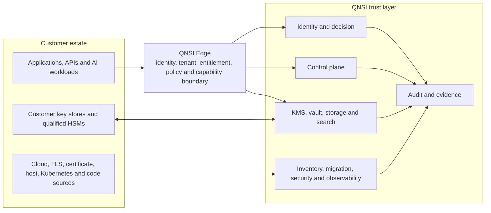
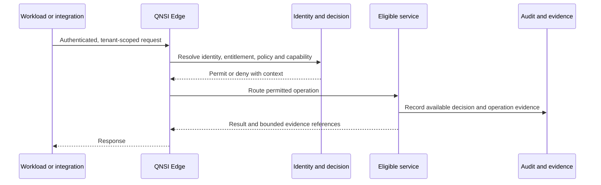
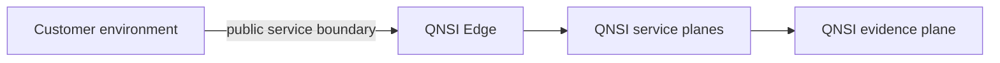
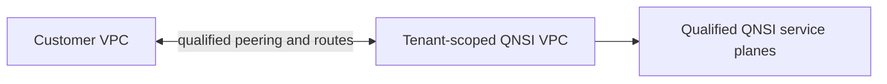
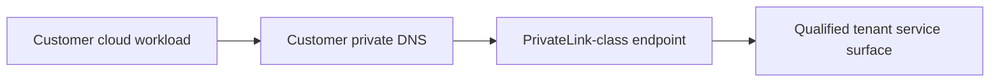
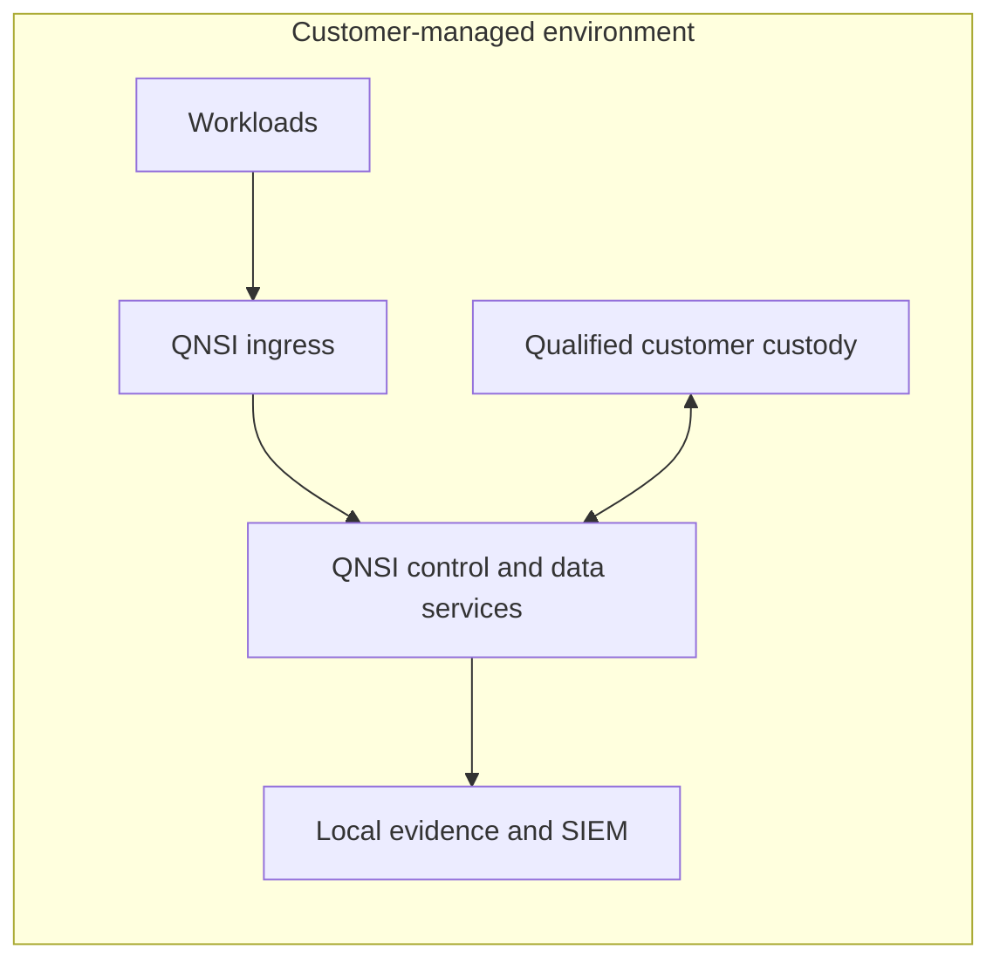
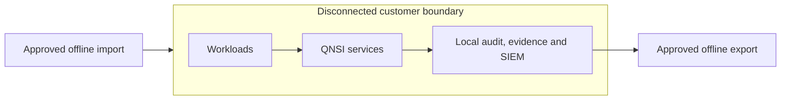

# Enterprise Reference Architectures

This packet describes where QNSI sits, which trust boundaries it operates, and what must be qualified for each deployment. It is an architecture statement, not evidence that every topology is generally available or operating for a particular customer.

## Common trust-layer model

The edge is the external transport-policy boundary. It resolves identity, tenant, entitlement, policy, capability, and routing context before an eligible service operation. Exact enforcement and evidence coverage remain operation- and deployment-specific.

## Request lifecycle

This is a control-flow model. It does not assert that every service operation emits every evidence type.

## Deployment patterns

### QNSI Cloud

- Status: default public service.
- Customer operates workload identity, integration configuration, data classification, and application authorization.
- QNSI operates the public edge and eligible hosted service planes.
- Operation availability depends on service version, tenant policy, entitlement, provider, and observed evidence.

### VPC-peered

- Status: provisioned per tenant through an enterprise engagement.
- Qualification covers routes, security groups, DNS, region, tenancy, transport, failover, telemetry, and evidence requirements.
- Source-defined architecture is not proof that a particular peering path is active.

### Private endpoint

- Status: provisioned per tenant.
- Qualification covers the cloud-provider endpoint service, DNS, routing, identity, eligible operations, and assurance evidence.
- A provider product name does not establish QNSI availability in that provider or region.

### On-premises

- Status: customer-environment deployment delivered through an enterprise engagement.
- Qualification covers compute, storage, networking, custody, updates, backup, recovery, telemetry, support, and evidence handling.
- No steady-state operating behavior should be inferred from container or deployment source alone.

### Air-gapped or sovereign

- Status: isolated, contract-scoped deployment.
- Qualification covers offline update provenance, signing, import/export, key custody, local identity, recovery, evidence transfer, and operator procedure.
- QNSI does not present air-gapped deployment as instant self-service availability.

## Orthogonal qualification axes

Network topology is only one dimension. Every enterprise deployment also qualifies:

| Axis      | Questions that require a deployment answer                                                                           |
| --------- | -------------------------------------------------------------------------------------------------------------------- |
| Tenancy   | Shared or dedicated compute, network, storage, database, keys, and operational access                                |
| Custody   | Software, customer-managed HSM, provider service, mechanism, firmware, mode, certificate scope, and failure behavior |
| Region    | Primary region, data residency, replication, failover, recovery point, and recovery time                             |
| Compute   | Standard CPU, confidential compute, GPU, enclave provider, attestation, and capacity                                 |
| Telemetry | Collection, redaction, retention, SIEM destination, export, and disconnected operation                               |
| Evidence  | Required event coverage, checkpointing, external verification, retention, export, and reviewer acceptance            |

## Shared responsibility

| Responsibility                             | Customer                                                                | QNSI                                                                      | Qualification evidence                                                             |
| ------------------------------------------ | ----------------------------------------------------------------------- | ------------------------------------------------------------------------- | ---------------------------------------------------------------------------------- |
| Workload identity and authorization intent | Owns identities, roles, application policy, and credential handling     | Enforces eligible tenant-scoped contracts at the QNSI boundary            | Identity path, tenant resolution, permit/deny behavior, and audit effects          |
| Data classification and retention          | Defines classification, legal basis, and retention requirements         | Applies configured eligible service controls                              | Configuration, stored state, deletion/retention behavior, and exported evidence    |
| Cryptographic policy                       | Approves target algorithms, exceptions, custody, and migration timing   | Provides policy and eligible cryptographic service contracts              | Primitive execution, provider, policy decision, failure behavior, and evidence     |
| Customer custody                           | Provides device/service, credentials, network, and operational approval | Provides capability-gated connector and qualification workflow            | Exact device, firmware, mechanism, operation, interruption, and certificate scope  |
| Deployment operations                      | Owns customer-side networking and environment dependencies              | Operates QNSI-managed boundaries or delivers scoped deployment procedures | Observed topology, health, failover, backup, recovery, telemetry, and support path |

## Evaluation links

- [System overview](./system-overview)
- [Trust boundaries](./trust-boundaries)
- [Control plane vs data plane](./control-plane-vs-data-plane)
- [Tenant isolation](./tenant-isolation)
- [Availability and high availability](./availability-and-ha)
- [Enterprise diligence index](../security/enterprise-diligence)
- [Public capability registry](https://github.com/heossihq/qnsi-public/blob/main/apps/web/lib/public-capabilities.ts)
